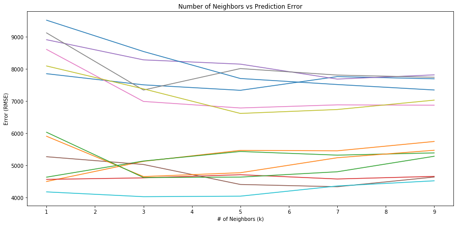
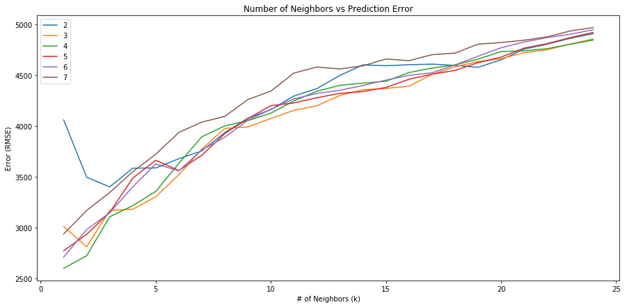

# Predicting Car Prices using K-Nearest Neighbors Algorithm
#### Daniel Torres - Updated 9/15/2020

#### [LinkedIn](https://www.linkedin.com/in/danielrichardtorres/) | [GitHub](https://github.com/danielrichardtorres) | [Back to Portfolio](https://danieltorres.tech)

---


## Introduction

### Goal:
Build a model that can predict car prices.

### Approach:
I will build a model using a K-Nearest Neighbor Regressor and the [machine learning workflow I've learned from dataquest.io](https://app.dataquest.io/profile/deducingdaniel). I will start by:

- Importing the data
- Determining which columns are numeric and can be used as features
- Determining which column is the target column.
- Displaying the first few rows of the data to make sure it looks correct

### Important Results

By building several models along the way, I was able to better understand K Nearest Neighbor Regressors. I found several interesting trends from this project that correspond with what I learned from dataquest.io:

-As you increase the number of neighbors (k) a model starts to improve (lower RMSE). Howver after a point, the model begins to preform worse (increasing RMSE).

-By increasing the number of features in a model, the error can reduce significantly.

See the process below!

##### Acknowledgements 
This project outline was provided by [dataquest.io](https://github.com/dataquestio/solutions) as a guided project.

# Looking at the Data


```python
#to import the data and view it I will use pandas
import pandas as pd
pd.options.display.max_columns = 99
```


```python
#After reviewing the data I will only use the following columns
cols = ['symboling', 'normalized-losses', 'make', 'fuel-type', 'aspiration', 'num-of-doors', 'body-style', 
        'drive-wheels', 'engine-location', 'wheel-base', 'length', 'width', 'height', 'curb-weight', 'engine-type', 
        'num-of-cylinders', 'engine-size', 'fuel-system', 'bore', 'stroke', 'compression-rate', 'horsepower', 'peak-rpm', 'city-mpg', 'highway-mpg', 'price']

#making a pandas dataframe with just those columns
cars = pd.read_csv('imports-85.data', names=cols)
```


```python
cars.info()
```

    <class 'pandas.core.frame.DataFrame'>
    RangeIndex: 205 entries, 0 to 204
    Data columns (total 26 columns):
    symboling            205 non-null int64
    normalized-losses    205 non-null object
    make                 205 non-null object
    fuel-type            205 non-null object
    aspiration           205 non-null object
    num-of-doors         205 non-null object
    body-style           205 non-null object
    drive-wheels         205 non-null object
    engine-location      205 non-null object
    wheel-base           205 non-null float64
    length               205 non-null float64
    width                205 non-null float64
    height               205 non-null float64
    curb-weight          205 non-null int64
    engine-type          205 non-null object
    num-of-cylinders     205 non-null object
    engine-size          205 non-null int64
    fuel-system          205 non-null object
    bore                 205 non-null object
    stroke               205 non-null object
    compression-rate     205 non-null float64
    horsepower           205 non-null object
    peak-rpm             205 non-null object
    city-mpg             205 non-null int64
    highway-mpg          205 non-null int64
    price                205 non-null object
    dtypes: float64(5), int64(5), object(16)
    memory usage: 41.7+ KB
    

It looks like all columns contain 205 non-null values.

The current numeric (int64, float64) columns are:

- symbolizing
- wheel-base
- length
- width
- height
- curb-weight
- engine-size
- compression-rate
- city-mpg
- highway-mpg

However a few columns that exist as *object* type but should be numeric are:

- horsepower
- normalized losses
- bore
- stroke
- peak-rpm
- price

I want a model that predicts __price__ so I will use that column as the _target_ for my model. 

I think we should look at the data to double check and then make these columns numeric by cleaning the data.


```python
cars.head()
```


<div>
<style scoped>
    .dataframe tbody tr th:only-of-type {
        vertical-align: middle;
    }

    .dataframe tbody tr th {
        vertical-align: top;
    }

    .dataframe thead th {
        text-align: right;
    }
</style>
<table border="1" class="dataframe">
  <thead>
    <tr style="text-align: right;">
      <th></th>
      <th>symboling</th>
      <th>normalized-losses</th>
      <th>make</th>
      <th>fuel-type</th>
      <th>aspiration</th>
      <th>num-of-doors</th>
      <th>body-style</th>
      <th>drive-wheels</th>
      <th>engine-location</th>
      <th>wheel-base</th>
      <th>length</th>
      <th>width</th>
      <th>height</th>
      <th>curb-weight</th>
      <th>engine-type</th>
      <th>num-of-cylinders</th>
      <th>engine-size</th>
      <th>fuel-system</th>
      <th>bore</th>
      <th>stroke</th>
      <th>compression-rate</th>
      <th>horsepower</th>
      <th>peak-rpm</th>
      <th>city-mpg</th>
      <th>highway-mpg</th>
      <th>price</th>
    </tr>
  </thead>
  <tbody>
    <tr>
      <th>0</th>
      <td>3</td>
      <td>?</td>
      <td>alfa-romero</td>
      <td>gas</td>
      <td>std</td>
      <td>two</td>
      <td>convertible</td>
      <td>rwd</td>
      <td>front</td>
      <td>88.6</td>
      <td>168.8</td>
      <td>64.1</td>
      <td>48.8</td>
      <td>2548</td>
      <td>dohc</td>
      <td>four</td>
      <td>130</td>
      <td>mpfi</td>
      <td>3.47</td>
      <td>2.68</td>
      <td>9.0</td>
      <td>111</td>
      <td>5000</td>
      <td>21</td>
      <td>27</td>
      <td>13495</td>
    </tr>
    <tr>
      <th>1</th>
      <td>3</td>
      <td>?</td>
      <td>alfa-romero</td>
      <td>gas</td>
      <td>std</td>
      <td>two</td>
      <td>convertible</td>
      <td>rwd</td>
      <td>front</td>
      <td>88.6</td>
      <td>168.8</td>
      <td>64.1</td>
      <td>48.8</td>
      <td>2548</td>
      <td>dohc</td>
      <td>four</td>
      <td>130</td>
      <td>mpfi</td>
      <td>3.47</td>
      <td>2.68</td>
      <td>9.0</td>
      <td>111</td>
      <td>5000</td>
      <td>21</td>
      <td>27</td>
      <td>16500</td>
    </tr>
    <tr>
      <th>2</th>
      <td>1</td>
      <td>?</td>
      <td>alfa-romero</td>
      <td>gas</td>
      <td>std</td>
      <td>two</td>
      <td>hatchback</td>
      <td>rwd</td>
      <td>front</td>
      <td>94.5</td>
      <td>171.2</td>
      <td>65.5</td>
      <td>52.4</td>
      <td>2823</td>
      <td>ohcv</td>
      <td>six</td>
      <td>152</td>
      <td>mpfi</td>
      <td>2.68</td>
      <td>3.47</td>
      <td>9.0</td>
      <td>154</td>
      <td>5000</td>
      <td>19</td>
      <td>26</td>
      <td>16500</td>
    </tr>
    <tr>
      <th>3</th>
      <td>2</td>
      <td>164</td>
      <td>audi</td>
      <td>gas</td>
      <td>std</td>
      <td>four</td>
      <td>sedan</td>
      <td>fwd</td>
      <td>front</td>
      <td>99.8</td>
      <td>176.6</td>
      <td>66.2</td>
      <td>54.3</td>
      <td>2337</td>
      <td>ohc</td>
      <td>four</td>
      <td>109</td>
      <td>mpfi</td>
      <td>3.19</td>
      <td>3.40</td>
      <td>10.0</td>
      <td>102</td>
      <td>5500</td>
      <td>24</td>
      <td>30</td>
      <td>13950</td>
    </tr>
    <tr>
      <th>4</th>
      <td>2</td>
      <td>164</td>
      <td>audi</td>
      <td>gas</td>
      <td>std</td>
      <td>four</td>
      <td>sedan</td>
      <td>4wd</td>
      <td>front</td>
      <td>99.4</td>
      <td>176.6</td>
      <td>66.4</td>
      <td>54.3</td>
      <td>2824</td>
      <td>ohc</td>
      <td>five</td>
      <td>136</td>
      <td>mpfi</td>
      <td>3.19</td>
      <td>3.40</td>
      <td>8.0</td>
      <td>115</td>
      <td>5500</td>
      <td>18</td>
      <td>22</td>
      <td>17450</td>
    </tr>
  </tbody>
</table>
</div>


It looks those columns above have object type because missing values were put in with a "?" symbol. 

I will clean the data by replacing those "?" symbols with a null value, and converting the nentioned object columns to numeric type.

# Cleaning the data

I will 

- use dataframe.replace() to replace all the ? values with numpy.nan 
- convert the columns to int or floats by using dataframe.astype

After that I will look at how many values are missing and deal with them accordingly.


```python
import numpy as np

# I will make a seperate dataframe for only the cols with numeric
#or soon to be numeric values
continuous_values_cols = ['normalized-losses', 'wheel-base',
'length', 'width', 'height', 'curb-weight', 'bore', 'stroke',
'compression-rate', 'horsepower', 'peak-rpm', 'city-mpg',
'highway-mpg', 'price']
numeric_cars = cars[continuous_values_cols].copy()

#I will replace the ? symbol and then check out the data
numeric_cars.replace('?', np.nan, inplace = True)
numeric_cars.info()
```

    <class 'pandas.core.frame.DataFrame'>
    RangeIndex: 205 entries, 0 to 204
    Data columns (total 14 columns):
    normalized-losses    164 non-null object
    wheel-base           205 non-null float64
    length               205 non-null float64
    width                205 non-null float64
    height               205 non-null float64
    curb-weight          205 non-null int64
    bore                 201 non-null object
    stroke               201 non-null object
    compression-rate     205 non-null float64
    horsepower           203 non-null object
    peak-rpm             203 non-null object
    city-mpg             205 non-null int64
    highway-mpg          205 non-null int64
    price                201 non-null object
    dtypes: float64(5), int64(3), object(6)
    memory usage: 22.5+ KB
    


```python
numeric_cars = numeric_cars.astype('float')
```


```python
#let's see how many values were "?"
numeric_cars.isnull().sum()
```


    normalized-losses    41
    wheel-base            0
    length                0
    width                 0
    height                0
    curb-weight           0
    bore                  4
    stroke                4
    compression-rate      0
    horsepower            2
    peak-rpm              2
    city-mpg              0
    highway-mpg           0
    price                 4
    dtype: int64


```python
#because we need price to be nonnull lets remove those missing rows
numeric_cars = numeric_cars.dropna(subset = ['price'])
numeric_cars.isnull().sum()
```


    normalized-losses    37
    wheel-base            0
    length                0
    width                 0
    height                0
    curb-weight           0
    bore                  4
    stroke                4
    compression-rate      0
    horsepower            2
    peak-rpm              2
    city-mpg              0
    highway-mpg           0
    price                 0
    dtype: int64


```python
#next I am going to replace the remaining missing values 
#I will replace the null with the respective column means (imputing)
numeric_cars = numeric_cars.fillna(numeric_cars.mean())
```


```python
#let's confirm no more missing values
numeric_cars.isnull().sum()
```


    normalized-losses    0
    wheel-base           0
    length               0
    width                0
    height               0
    curb-weight          0
    bore                 0
    stroke               0
    compression-rate     0
    horsepower           0
    peak-rpm             0
    city-mpg             0
    highway-mpg          0
    price                0
    dtype: int64


```python
#next I will normalize all values so the values are between 0 and 1
# except for the target column - price
price_col = numeric_cars['price']
numeric_cars = (numeric_cars - numeric_cars.min())/(numeric_cars.max()-numeric_cars.min())
numeric_cars['price'] = price_col
```


```python
#let's make sure that worked
numeric_cars.head()
```


<div>
<style scoped>
    .dataframe tbody tr th:only-of-type {
        vertical-align: middle;
    }

    .dataframe tbody tr th {
        vertical-align: top;
    }

    .dataframe thead th {
        text-align: right;
    }
</style>
<table border="1" class="dataframe">
  <thead>
    <tr style="text-align: right;">
      <th></th>
      <th>normalized-losses</th>
      <th>wheel-base</th>
      <th>length</th>
      <th>width</th>
      <th>height</th>
      <th>curb-weight</th>
      <th>bore</th>
      <th>stroke</th>
      <th>compression-rate</th>
      <th>horsepower</th>
      <th>peak-rpm</th>
      <th>city-mpg</th>
      <th>highway-mpg</th>
      <th>price</th>
    </tr>
  </thead>
  <tbody>
    <tr>
      <th>0</th>
      <td>0.298429</td>
      <td>0.058309</td>
      <td>0.413433</td>
      <td>0.324786</td>
      <td>0.083333</td>
      <td>0.411171</td>
      <td>0.664286</td>
      <td>0.290476</td>
      <td>0.1250</td>
      <td>0.294393</td>
      <td>0.346939</td>
      <td>0.222222</td>
      <td>0.289474</td>
      <td>13495.0</td>
    </tr>
    <tr>
      <th>1</th>
      <td>0.298429</td>
      <td>0.058309</td>
      <td>0.413433</td>
      <td>0.324786</td>
      <td>0.083333</td>
      <td>0.411171</td>
      <td>0.664286</td>
      <td>0.290476</td>
      <td>0.1250</td>
      <td>0.294393</td>
      <td>0.346939</td>
      <td>0.222222</td>
      <td>0.289474</td>
      <td>16500.0</td>
    </tr>
    <tr>
      <th>2</th>
      <td>0.298429</td>
      <td>0.230321</td>
      <td>0.449254</td>
      <td>0.444444</td>
      <td>0.383333</td>
      <td>0.517843</td>
      <td>0.100000</td>
      <td>0.666667</td>
      <td>0.1250</td>
      <td>0.495327</td>
      <td>0.346939</td>
      <td>0.166667</td>
      <td>0.263158</td>
      <td>16500.0</td>
    </tr>
    <tr>
      <th>3</th>
      <td>0.518325</td>
      <td>0.384840</td>
      <td>0.529851</td>
      <td>0.504274</td>
      <td>0.541667</td>
      <td>0.329325</td>
      <td>0.464286</td>
      <td>0.633333</td>
      <td>0.1875</td>
      <td>0.252336</td>
      <td>0.551020</td>
      <td>0.305556</td>
      <td>0.368421</td>
      <td>13950.0</td>
    </tr>
    <tr>
      <th>4</th>
      <td>0.518325</td>
      <td>0.373178</td>
      <td>0.529851</td>
      <td>0.521368</td>
      <td>0.541667</td>
      <td>0.518231</td>
      <td>0.464286</td>
      <td>0.633333</td>
      <td>0.0625</td>
      <td>0.313084</td>
      <td>0.551020</td>
      <td>0.138889</td>
      <td>0.157895</td>
      <td>17450.0</td>
    </tr>
  </tbody>
</table>
</div>


Looks good! Let's make the model!

# Univariate Model

I am going to start out by using univariate k regressor. This means the model will only use __one of the columsn__ to try and predict the price of a car.

To do that I will:
- Import the regressor from sklearn as well as a mean squared error metric
- define a function to train and test my data given the features, target and the dataframe


```python
from sklearn.neighbors import KNeighborsRegressor
from sklearn.metrics import mean_squared_error

def knn_train_test(feature_col, target_col, df):
    #instantiate knn
    model = KNeighborsRegressor()
    np.random.seed(1)
    
    # Randomize order of rows in data frame.
    shuffled_index = np.random.permutation(df.index)
    rand_df = df.reindex(shuffled_index)
    # Divide number of rows in half and round.
    last_train_row = int(len(rand_df)/2)
    # Select the first half and set as training set.
    train_df = rand_df.iloc[0:last_train_row]
    # Select the second half and set as test set.
    test_df = rand_df.iloc[last_train_row:]
    #fit model
    model.fit(train_df[[feature_col]],train_df[target_col])
    #make predictions
    predict_labels = model.predict(test_df[[feature_col]])
    #calc RMSE and return
    mse = mean_squared_error(test_df[target_col], predict_labels)
    rmse = mse**.5
    return rmse
```


```python
#lets test this on each col (except price)

#create a dictionary for the results
rmse_results = {}

#make a df with just the feature columns
train_cols = numeric_cars.columns.drop('price')

#calculate the RMSE for the model based off each column and save it
for col in train_cols:
    rmse_results[col] = knn_train_test(col, 'price', numeric_cars)
    
rmse_results_series = pd.Series(rmse_results)
rmse_results_series.sort_values()
```


    horsepower           4037.037713
    curb-weight          4401.118255
    highway-mpg          4630.026799
    width                4704.482590
    city-mpg             4766.422505
    length               5427.200961
    wheel-base           5461.553998
    compression-rate     6610.812153
    bore                 6780.627785
    normalized-losses    7330.197653
    peak-rpm             7697.459696
    stroke               8006.529545
    height               8144.441043
    dtype: float64


### Univariate model results

Clearly some features are better at predicting price than others. 

However we can also take a look at the _K values_ in our models to see how this affects the prediction ability. 

## Parameterizing for K

We'll redefine the function below for a few different values of K and plot the results


```python
def knn_train_test(feature_col, target_col, df):

    np.random.seed(1)
    
    # Randomize order of rows in data frame.
    shuffled_index = np.random.permutation(df.index)
    rand_df = df.reindex(shuffled_index)
    # Divide number of rows in half and round.
    last_train_row = int(len(rand_df)/2)
    # Select the first half and set as training set.
    train_df = rand_df.iloc[0:last_train_row]
    # Select the second half and set as test set.
    test_df = rand_df.iloc[last_train_row:]
    
    k_values = [1,3,5,7,9]
    k_rmes = {}
    
    for k in k_values:
        #instantiate knn
        model = KNeighborsRegressor(n_neighbors = k)
        #fit model
        model.fit(train_df[[feature_col]],train_df[target_col])
        #make predictions
        predict_labels = model.predict(test_df[[feature_col]])
        #calc RMSE and return
        mse = mean_squared_error(test_df[target_col], predict_labels)
        rmse = mse**.5
        k_rmes[k] = rmse
    return k_rmes
```


```python
#lets test this on each col (except price)

k_rmse_results = {}
train_cols = numeric_cars.columns.drop('price')

for col in train_cols:
    k_rmse_results[col] = knn_train_test(col, 'price', numeric_cars)
    
k_rmse_results
```


    {'normalized-losses': {1: 7846.750605148984,
      3: 7500.5698123109905,
      5: 7330.197653434445,
      7: 7756.421586234123,
      9: 7688.096096891432},
     'wheel-base': {1: 4493.734068810494,
      3: 5120.161506064513,
      5: 5461.553997873057,
      7: 5448.1070513823315,
      9: 5738.405685192312},
     'length': {1: 4628.45550121557,
      3: 5129.8358210721635,
      5: 5427.2009608367125,
      7: 5313.427720847974,
      9: 5383.054514833446},
     'width': {1: 4559.257297950061,
      3: 4606.413692169901,
      5: 4704.482589704386,
      7: 4571.485046194653,
      9: 4652.914172067787},
     'height': {1: 8904.04645636071,
      3: 8277.609643045525,
      5: 8144.441042663747,
      7: 7679.598124393773,
      9: 7811.03606291223},
     'curb-weight': {1: 5264.290230758878,
      3: 5022.318011757233,
      5: 4401.118254793124,
      7: 4330.608104418053,
      9: 4632.044474454401},
     'bore': {1: 8602.58848450066,
      3: 6984.239489480916,
      5: 6780.627784685976,
      7: 6878.097965921532,
      9: 6866.808502038413},
     'stroke': {1: 9116.495955406906,
      3: 7338.68466990294,
      5: 8006.529544647101,
      7: 7803.937796804327,
      9: 7735.554366079291},
     'compression-rate': {1: 8087.205346523092,
      3: 7375.063685578359,
      5: 6610.812153159129,
      7: 6732.801282941515,
      9: 7024.485525463435},
     'horsepower': {1: 4170.054848037801,
      3: 4020.8492630885394,
      5: 4037.0377131537603,
      7: 4353.811860277134,
      9: 4515.135617419103},
     'peak-rpm': {1: 9511.480067750124,
      3: 8537.550899973421,
      5: 7697.4596964334805,
      7: 7510.294160083481,
      9: 7340.041341263401},
     'city-mpg': {1: 5901.143574354764,
      3: 4646.746408727155,
      5: 4766.422505090134,
      7: 5232.523034167316,
      9: 5465.209492527533},
     'highway-mpg': {1: 6025.594966720739,
      3: 4617.305019788554,
      5: 4630.026798588056,
      7: 4796.061440186946,
      9: 5278.358056953987}}


Wow! That's a bit difficult to intepret. I'll make a graph so we can see what's going on here.

### Vizualizing the Increase of Neighbors (K)


```python
import matplotlib.pyplot as plt
%matplotlib inline
fig, ax = plt.subplots(figsize=(15, 7))
for k,v in k_rmse_results.items():
    x = list(v.keys())
    y = list(v.values())
    

    plt.plot(x,y)
    plt.xlabel('# of Neighbors (k)')
    plt.ylabel('Error (RMSE)')
    plt.title('Number of Neighbors vs Prediction Error')
```


    

    


As we increase the number of neighbors __the error generally goes down__. However a handful of models do reach a minima, and slowly increase error again. 

# Multivariate model

I will now modify the function to accept a list of column names (instead of a single column) in order to train with more than one variable or feature.


```python
def knn_train_test(feature_cols, target_col, df):

    np.random.seed(1)
    
    # Randomize order of rows in data frame.
    shuffled_index = np.random.permutation(df.index)
    rand_df = df.reindex(shuffled_index)
    # Divide number of rows in half and round.
    last_train_row = int(len(rand_df)/2)
    # Select the first half and set as training set.
    train_df = rand_df.iloc[0:last_train_row]
    # Select the second half and set as test set.
    test_df = rand_df.iloc[last_train_row:]
    
    k_values = [5]
    k_rmes = {}
    
    for k in k_values:
        #instantiate knn
        model = KNeighborsRegressor(n_neighbors = k)
        #fit model
        model.fit(train_df[feature_cols],train_df[target_col])
        #make predictions
        predict_labels = model.predict(test_df[feature_cols])
        #calc RMSE and return
        mse = mean_squared_error(test_df[target_col], predict_labels)
        rmse = mse**.5
        k_rmes[k] = rmse
    return k_rmes
```


```python
#lets test this with the best featues, for now I'll consider best to be the best average RMSE

# Compute average RMSE across different `k` values for each feature.
feature_avg_rmse = {}
for k,v in k_rmse_results.items():
    avg_rmse = np.mean(list(v.values()))
    feature_avg_rmse[k] = avg_rmse
series_avg_rmse = pd.Series(feature_avg_rmse)
sorted_series_avg_rmse = series_avg_rmse.sort_values()
print(sorted_series_avg_rmse)

sorted_features = sorted_series_avg_rmse.index
```

    horsepower           4219.377860
    width                4618.910560
    curb-weight          4730.075815
    highway-mpg          5069.469256
    length               5176.394904
    city-mpg             5202.409003
    wheel-base           5252.392462
    compression-rate     7166.073599
    bore                 7222.472445
    normalized-losses    7624.407151
    stroke               8000.240467
    peak-rpm             8119.365233
    height               8163.346266
    dtype: float64
    


```python
#Now I'll train a multivariate model using the best features
# I'll start with the best 2 and make models up to 7 different features 

k_rmse_results = {}
for nr_best_feats in range(2,8):
    k_rmse_results['{} best features'.format(nr_best_feats)] = knn_train_test(
        sorted_features[:nr_best_feats],
        'price',
        numeric_cars
    )

k_rmse_results
```


    {'2 best features': {5: 3589.3132622073304},
     '3 best features': {5: 3305.9401397969677},
     '4 best features': {5: 3358.6915801682458},
     '5 best features': {5: 3665.546673045813},
     '6 best features': {5: 3628.261188214127},
     '7 best features': {5: 3724.7688264235985}}


# Hyperparameter tuning

Let's vary k now from 1 to 25 and see which one gets us the lowest RMSE.

Or in otherwords, let's find the optimal number of neighbors for each model we've created.


```python
def knn_train_test(train_cols, target_col, df):
    np.random.seed(1)
    
    # Randomize order of rows in data frame.
    shuffled_index = np.random.permutation(df.index)
    rand_df = df.reindex(shuffled_index)

    # Divide number of rows in half and round.
    last_train_row = int(len(rand_df) / 2)
    
    # Select the first half and set as training set.
    # Select the second half and set as test set.
    train_df = rand_df.iloc[0:last_train_row]
    test_df = rand_df.iloc[last_train_row:]
    
    k_values = list(range(1,25))
    k_rmses = {}
    
    for k in k_values:
        # Fit model using k nearest neighbors.
        knn = KNeighborsRegressor(n_neighbors=k)
        knn.fit(train_df[train_cols], train_df[target_col])

        # Make predictions using model.
        predicted_labels = knn.predict(test_df[train_cols])

        # Calculate and return RMSE.
        mse = mean_squared_error(test_df[target_col], predicted_labels)
        rmse = np.sqrt(mse)
        
        k_rmses[k] = rmse
    return k_rmses

k_rmse_results = {}

for nr_best_feats in range(2,8):
    k_rmse_results['{} best features'.format(nr_best_feats)] = knn_train_test(
        sorted_features[:nr_best_feats],
        'price',
        numeric_cars
    )

k_rmse_results
```


    {'2 best features': {1: 4061.9613050304106,
      2: 3497.49936199118,
      3: 3402.8692636542114,
      4: 3587.0044198356923,
      5: 3589.3132622073304,
      6: 3680.062981095498,
      7: 3756.92796407086,
      8: 3937.770418264052,
      9: 4078.3485919700097,
      10: 4163.828373808731,
      11: 4297.135962941241,
      12: 4370.753019740529,
      13: 4500.462028689254,
      14: 4604.156707686779,
      15: 4595.345097101211,
      16: 4605.433669910023,
      17: 4611.2845838376215,
      18: 4598.88218482117,
      19: 4579.964891966457,
      20: 4653.966845712387,
      21: 4759.076059393234,
      22: 4807.805949321809,
      23: 4865.320887129985,
      24: 4910.715769042787},
     '3 best features': {1: 3013.0109985241875,
      2: 2813.285969825997,
      3: 3171.585284478674,
      4: 3182.3137417981943,
      5: 3305.9401397969677,
      6: 3522.506848900376,
      7: 3774.3772094554106,
      8: 3978.969124021116,
      9: 3992.923680588881,
      10: 4076.2381473803043,
      11: 4156.388331131807,
      12: 4201.10713385948,
      13: 4303.62676861325,
      14: 4359.693296989702,
      15: 4371.771103372868,
      16: 4394.4846551644205,
      17: 4510.399710057406,
      18: 4584.310961865486,
      19: 4636.62620477063,
      20: 4664.465847866811,
      21: 4724.096637428273,
      22: 4752.535484102914,
      23: 4808.703310452101,
      24: 4858.9452710176065},
     '4 best features': {1: 2600.746383728188,
      2: 2725.4325072335123,
      3: 3108.8580314362966,
      4: 3217.3135209486827,
      5: 3358.6915801682458,
      6: 3633.1687033129465,
      7: 3896.127441396644,
      8: 4002.8383900652543,
      9: 4055.5309369929582,
      10: 4128.67807741542,
      11: 4249.827289347268,
      12: 4344.035898237492,
      13: 4402.995293166156,
      14: 4424.314365328619,
      15: 4442.943179452285,
      16: 4528.57927503009,
      17: 4572.28806185627,
      18: 4604.034045947238,
      19: 4660.524954508328,
      20: 4735.352015758023,
      21: 4742.329532242572,
      22: 4763.606459864159,
      23: 4807.076030845482,
      24: 4848.127192424658},
     '5 best features': {1: 2773.8991269216394,
      2: 2936.079965592973,
      3: 3152.3415515178144,
      4: 3488.57822210674,
      5: 3665.546673045813,
      6: 3563.9910249785435,
      7: 3714.642677357888,
      8: 3927.6655582704293,
      9: 4074.724411578548,
      10: 4202.692919892065,
      11: 4228.8377103033245,
      12: 4280.7222580306225,
      13: 4323.694733441248,
      14: 4341.598003940922,
      15: 4381.910642108479,
      16: 4462.210967318207,
      17: 4512.666161759793,
      18: 4549.02427742861,
      19: 4625.542238703432,
      20: 4680.4075341436155,
      21: 4769.300287838951,
      22: 4813.1714929806085,
      23: 4871.956026848068,
      24: 4922.889655107399},
     '6 best features': {1: 2711.8064473558566,
      2: 2983.298229599695,
      3: 3147.7872363214947,
      4: 3403.6163252822316,
      5: 3628.261188214127,
      6: 3560.755117162712,
      7: 3766.0781859391327,
      8: 3892.1055790125597,
      9: 4058.9711219417254,
      10: 4166.67360017509,
      11: 4269.212015998027,
      12: 4322.589179086113,
      13: 4354.036540959632,
      14: 4401.309355187226,
      15: 4453.998952687242,
      16: 4501.196168590726,
      17: 4526.2347689665985,
      18: 4602.93889872311,
      19: 4688.897400085559,
      20: 4772.5184826673,
      21: 4829.188076586143,
      22: 4872.709482789408,
      23: 4905.43274491528,
      24: 4949.660992656672},
     '7 best features': {1: 2939.455881823729,
      2: 3171.000019124429,
      3: 3347.664749333091,
      4: 3551.3287397915315,
      5: 3724.7688264235985,
      6: 3938.1829407910336,
      7: 4040.7640392146413,
      8: 4097.022947423422,
      9: 4262.464110320886,
      10: 4345.719761346608,
      11: 4522.9657101005205,
      12: 4582.881958294433,
      13: 4563.793202933789,
      14: 4594.649924149825,
      15: 4662.132251674249,
      16: 4645.388952011478,
      17: 4704.408767954525,
      18: 4720.114219601946,
      19: 4808.08489511181,
      20: 4823.994871008861,
      21: 4846.790465254446,
      22: 4879.2244866425535,
      23: 4937.633664214842,
      24: 4971.3895542383}}


```python
#let's plot it since it's hard to tell

fig, ax = plt.subplots(figsize=(15, 7))
for k,v in k_rmse_results.items():
    x = list(v.keys())
    y = list(v.values())
    
    plt.plot(x,y)
    plt.xlabel('# of Neighbors (k)')
    plt.ylabel('Error (RMSE)')
    plt.title('Number of Neighbors vs Prediction Error')
    plt.legend(['2','3','4','5','6','7'])
```


    

    


### Hyperparameter Tuning - Finding the Best K Value for our Models

We can see the same pattern from earlier. _A high number of neighbors is useful, up to a point_. So what is the optimal number of neighbors?

Or in other words: __which k value is optimal for each model__?
- 2 features - 3 neighbors
- 3 features - 2 neighbors
- 4 features - 1 neighbor
- 5 features - 1 neighbor
- 6 features - 1 neighbor
- 7 features - 1 neighbor

Here we also see another pattern, _as the number of neighbors features increase in the model, the number of neighbors for optimal prediction goes down_.

# Final Thoughts on Predicting Car Prices with Nearest Neighbor Regressor

I accomplished the goal of building a model that can predict car prices. By building several models along the way, I was able to better understand K Nearest Neighbor Regressors. I found several interesting trends from this project that correspond with what I learned from dataquest.io:

- As you increase the number of neighbors (k) a model starts to improve (lower RMSE). Howver after a point, the model begins to preform worse (increasing RMSE).

- By increasing the number of features in a model, the error can reduce significantly.

Overall a Neighbor Regressor is an excellent model for predicting prices on cars.


#### [LinkedIn](https://www.linkedin.com/in/danielrichardtorres/) | [GitHub](https://github.com/danielrichardtorres) | [Back to Portfolio](https://danieltorres.tech)
Dataquest Guided Project by Daniel Torres 
